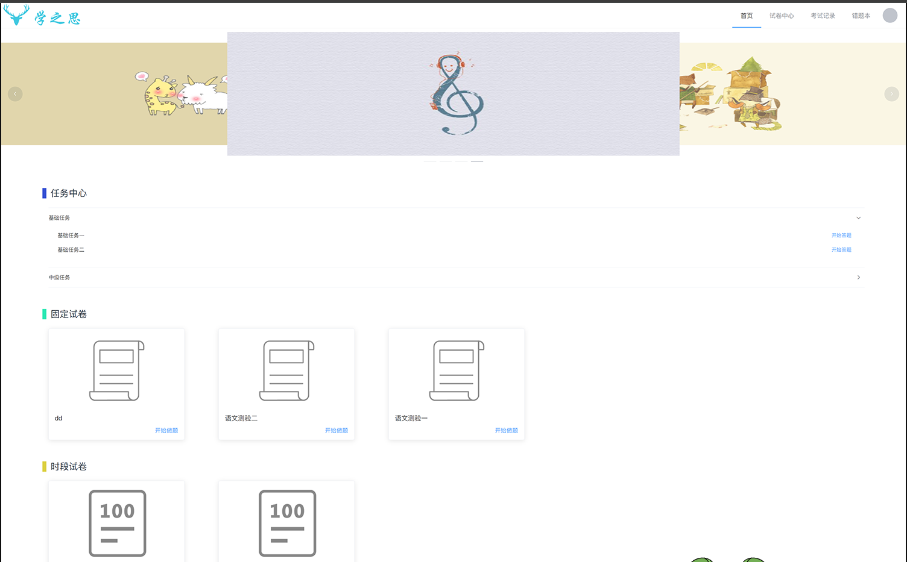
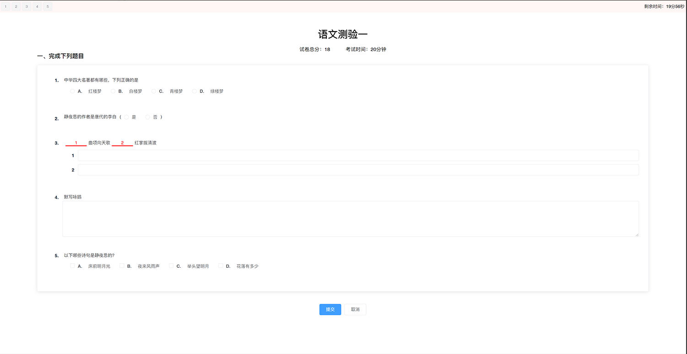
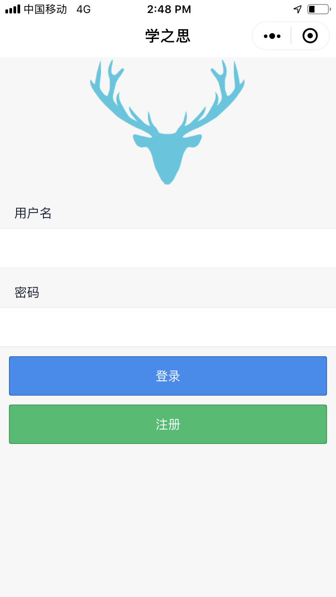
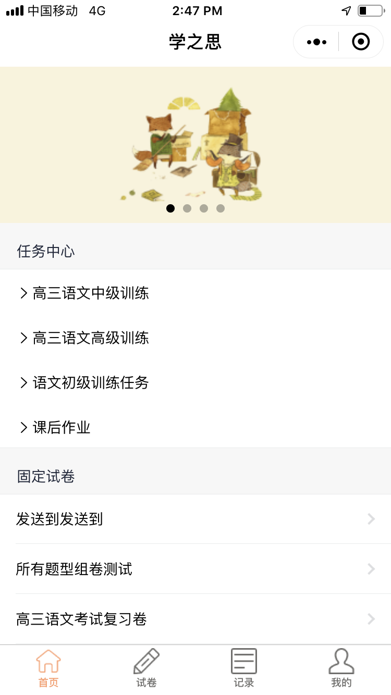
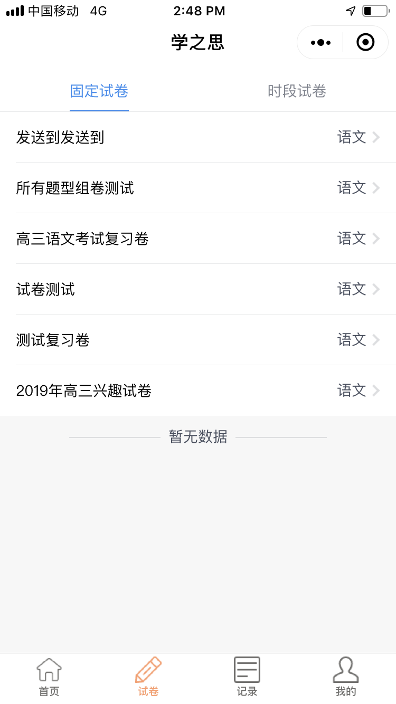
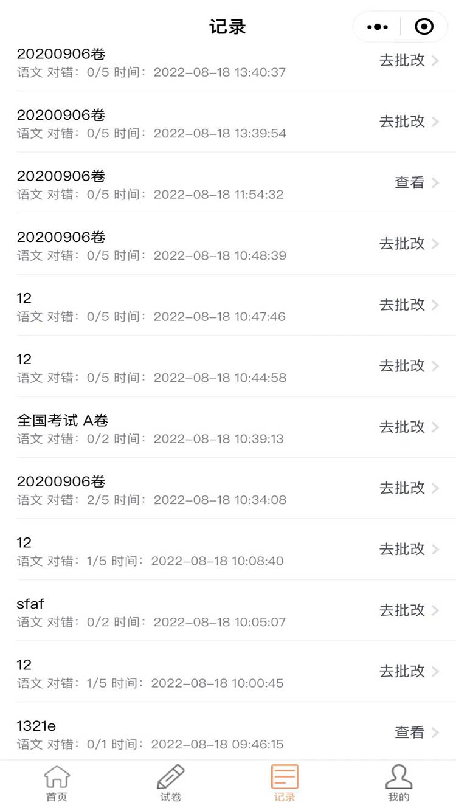
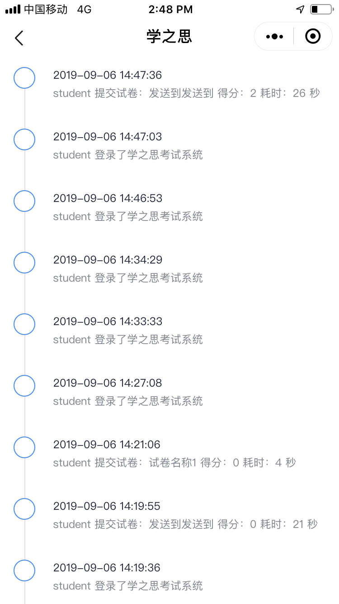
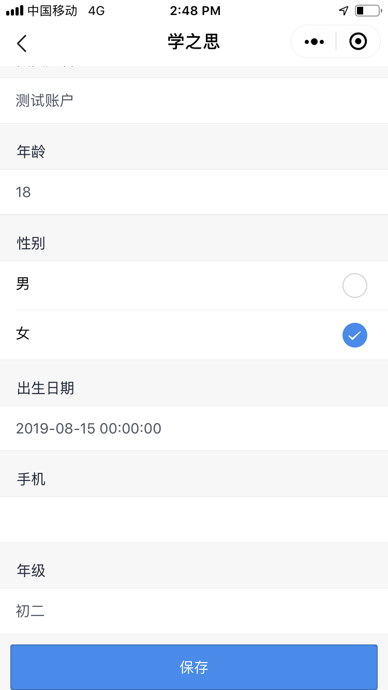
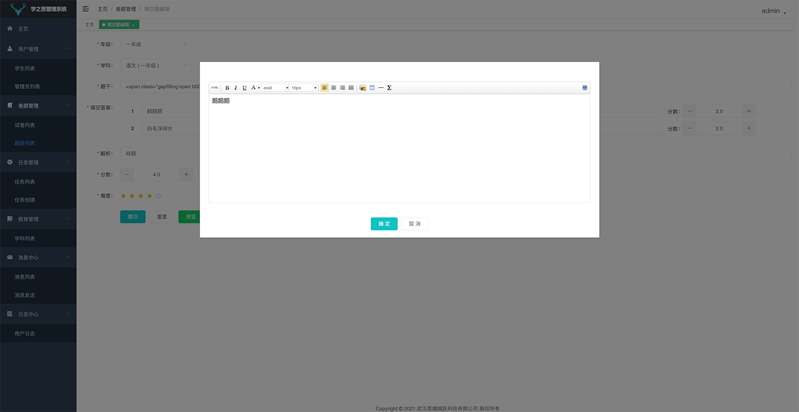

# 在线考试系统

### 介绍
在线考试系统，答题小程序，包含web版和小程序版， 支持全平台使用！！！ 这是一款 java + vue 的前后端分离的考试系统。主要优点是开发、部署简单快捷、界面设计友好、代码结构清晰。支持web端和微信小程序，能覆盖到pc机和手机等设备。
PS：由于网络原因，GitHub有时候图片加载不出来，移步到码云查看：https://gitee.com/xiaoxu_1_365855675/online-examination-system
### 部分截图

#### web版

#### 小程序版

#### 后台管理系统

### 联系我
微信：xtb365 可提供源码、有偿技术咨询、毕业指导、课程设计、定制开发等等， 备注来意
